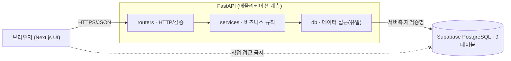
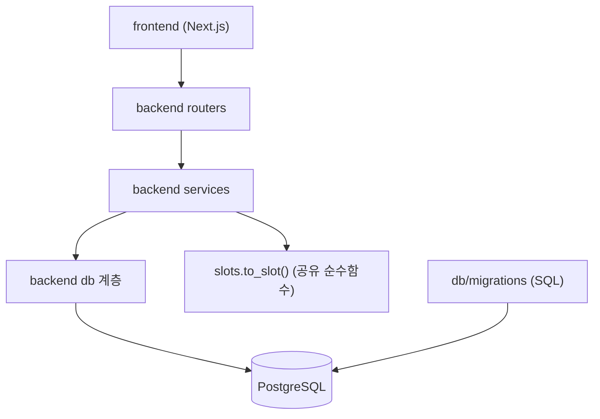
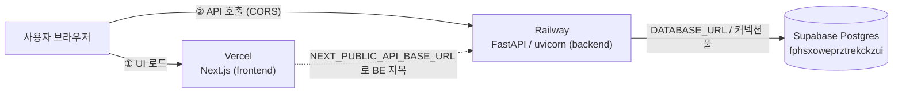
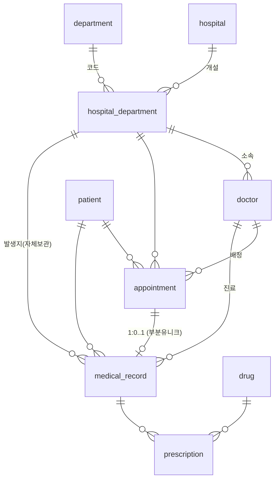

# Architecture Spine — hospital-care

> 1인 개발 · 마감 2026-07-16(목) · 목표 = **핵심 한 줄기 E2E 관통 + Railway 배포**. 넓이보다 관통 우선.
> 스택·보안·데이터모델·가용성 규칙은 PRD/addendum에서 이미 확정 — 이 스파인은 그 위에서 **조각들이 어긋나지 않게 하는 불변식**만 못 박는다.

## Design Paradigm

**3-tier 클라이언트-서버 + 백엔드 계층형(layered).**

- **표현 계층 — Next.js(App Router).** 얇은 클라이언트. 화면과 상태만 갖고, 데이터는 오직 FastAPI를 통해 얻는다. DB/시크릿을 절대 모른다.
- **애플리케이션 계층 — FastAPI.** 유일한 비즈니스 로직·DB 접근 지점. 내부는 `routers`(HTTP·검증) → `services`(비즈니스 규칙) → `db`(데이터 접근)의 3단 단방향.
- **데이터 계층 — Supabase(PostgreSQL).** 정규화 9테이블. FastAPI만 서버측 자격증명으로 접근.



## Invariants & Rules

의존은 **위 다이어그램 방향으로만** 흐른다. 아래 화살표를 거스르는 import/호출은 위반이다.



### AD-1 — 3-tier 경계와 의존 방향 `[ADOPTED]`
- **Binds:** all · NFR-3, A1
- **Prevents:** 프런트가 Supabase를 직접 호출하거나 서버 시크릿을 번들에 넣는 것
- **Rule:** 데이터 흐름은 브라우저 → FastAPI(HTTP) → PostgreSQL 한 방향뿐. 브라우저 코드는 DB 드라이버·서버 자격증명을 import하지 않는다. 프런트가 아는 유일한 백엔드 좌표는 `NEXT_PUBLIC_API_BASE_URL`.

### AD-2 — 계층형 백엔드 · DB I/O는 `db` 계층 단일 소유
- **Binds:** backend 전체
- **Prevents:** 라우터/서비스 곳곳에서 DB 커넥션을 열거나 비즈니스 규칙이 라우터로 새는 것
- **Rule:** `routers`는 HTTP·입출력 검증만 하고 `services`를 호출한다. `services`가 모든 비즈니스 규칙과 **트랜잭션 경계**를 소유한다. **DB 커넥션을 여는 코드는 `db` 계층뿐**(마이그레이션 제외). 상향 import(예: db→services) 금지.

### AD-3 — 슬롯 키는 하나의 정규화 식(Python `to_slot` ≡ SQL floor)
- **Binds:** FR-6, FR-15, FR-16 (예약·가용성·walk-in)
- **Prevents:** 예약과 walk-in이 슬롯을 다르게 계산해 walk-in이 예약을 실제로 막지 못하는 것
- **Rule:** 슬롯 = 시각을 **30분 격자로 floor(UTC 기준)**. **점유 판정의 source of truth는 SQL 충돌 쿼리**(AD-4)이며, 그 쿼리는 `appointment.reserved_at`과 `medical_record.visited_at`을 **동일한 floor 식**으로 정규화해 `(doctor_id, slot)`을 비교한다 — 저장 형태(초 단위 값)에 의존하지 않는다. Python `to_slot()`은 이 식을 **그대로 미러링**해 예약 시각 검증·UX에만 쓰고, 원시 timestamp를 직접 비교하지 않는다. floor 식은 정확히 한 벌(SQL·Python 각 1). *(minute 기반 정렬은 KST처럼 정시 오프셋 tz에서 tz-불변이라 `reserved_at` 30분 CHECK와 일치.)*

### AD-4 — 가용성 검사는 단일 서비스 함수, 검사+삽입을 **한 트랜잭션**으로
- **Binds:** FR-6, FR-7, FR-15, FR-16
- **Prevents:** 세 쓰기 경로(예약 생성·의사 변경·walk-in)가 충돌 검사를 제각각 구현하거나, 검사와 삽입 사이 경쟁이 생기는 것
- **Rule:** 점유가 발생하는 모든 쓰기는 삽입 직전에 단 하나의 `check_and_occupy(conn, doctor_id, slot, exclude_appointment_id=None)`를 호출한다. **이 함수는 자체 커넥션을 열지 않고 호출자(서비스)가 연 트랜잭션(`conn`)을 받아 검사와 삽입을 같은 트랜잭션에서 수행한다** — 그래야 단일 세션에서 검사↔삽입 원자성이 성립. 충돌원은 **두 테이블의 합집합** — `appointment`(status ∈ 대기·확정) ∪ walk-in `medical_record`(`appointment_id` null) — 을 `(doctor_id, slot)`으로 본다. 취소=슬롯 해제, 완료=과거라 충돌 무관.
  - **예약 생성(P0):** 의사 **직접 선택 필수** → `appointment.doctor_id`는 항상 채워짐(DB는 nullable이나 앱이 P0에서 강제; nullable은 스키마 안정성·P1 자동배정용).
  - **의사 변경(FR-7):** 새 `(doctor_id, slot)` 점유 확인 시 **자기 행 제외**(`exclude_appointment_id`)하고, 같은 트랜잭션에서 이전 슬롯 해제 + 새 슬롯 점유. *(P1의 전체 재검사 플로우는 Deferred.)*
  - **강제 경계(정직):** 단일 세션에서 차단을 보장하며 동시 요청 경쟁(TOCTOU)은 범위 밖.

### AD-5 — `appointment.status` 전이는 예약 서비스만 소유, 완료는 기록 생성의 부작용
- **Binds:** FR-8, FR-9
- **Prevents:** status가 여러 곳에서 바뀌거나, 기록 없이 완료되거나 완료 없이 기록되거나, **취소·미확정 예약에 기록이 붙어 불법 전이**가 나는 것
- **Rule:** `appointment.status`(대기→확정→완료/취소)를 바꾸는 코드는 예약 서비스뿐. **예약 기반 진료 기록은 그 예약이 `확정` 상태일 때만 생성 가능**(서비스 가드) — 대기/취소/완료 예약엔 거부. 기록이 작성되면 **같은 트랜잭션에서** 그 예약이 `확정`→`완료`로 전이된다. walk-in 기록(`appointment_id` null)은 status를 건드리지 않는다. **예약당 진료 기록 1건**은 부분 유니크 인덱스(AD-9)가 강제하고, 상태 적격성은 위 `확정` 가드가 담당한다.

### AD-6 — 진료 기록은 발생 시점 진료과·의사를 자체 저장(이력 불변)
- **Binds:** FR-9, FR-16
- **Prevents:** 의사의 소속(진료과)이 나중에 바뀔 때 과거 기록이 왜곡되는 것, 또는 진료과 출처가 경로마다 달라지는 것
- **Rule:** `medical_record` 생성 시 `hospital_department_id`·`doctor_id`를 **그 순간 값으로 복사 저장**하고, 과거 기록의 진료과를 `doctor → hospital_department` **라이브 조인으로 유도하지 않는다**. 진료과 출처를 경로별로 고정: **예약 기반 기록** → 그 예약의 `hospital_department_id`(예약된 과)를 복사. **walk-in** → 배정된 의사의 **현재 소속** 진료과를 복사. 두 컬럼 모두 NOT NULL이므로 의사가 정해진 뒤에만 삽입(빈 의사면 앱이 먼저 거부).

### AD-7 — 보안 posture: RLS deny-by-default + 백엔드 자격증명만 `[ADOPTED]`
- **Binds:** NFR-4, A1 · 9개 테이블 전부
- **Prevents:** 공개(anon) 키로 DB 전체가 열리는 것, 서버 자격증명이 프런트 번들로 새는 것
- **Rule:** 9테이블 전부 `enable row level security`, **anon 역할 허용 정책은 만들지 않는다**(deny-by-default). DB 접근은 FastAPI가 **서버측 자격증명**으로만 수행 — psycopg 경로에서는 `DATABASE_URL`(테이블 소유자로 접속 → RLS 우회)이며 **환경변수 전용**, Next.js 번들에 절대 넣지 않는다. RLS 마이그레이션은 배포 뼈대와 함께 P0. **완료 정의:** 배포 후 Supabase advisor로 **9테이블 RLS ON을 확인**해야 "완료". *한계(정직):* 로그인이 없어 DB 레벨 사용자별 격리는 아님.

### AD-8 — 환자 스코핑은 명시적 API 필터일 뿐, 보안이 아님 `[ADOPTED]`
- **Binds:** FR-2, FR-11
- **Prevents:** 엔드포인트마다 환자 스코핑을 제각각 하거나, 전체 환자 데이터가 새는 것
- **Rule:** 환자용 조회 엔드포인트는 **명시적 `patient_id`를 쿼리 파라미터(`?patient_id=`)** 로 받아 서비스가 그 값으로 필터한다. 모든 환자용 엔드포인트가 동일한 `patient_id` 전송 규약을 쓴다(경로 세그먼트 혼용 금지). 이는 **앱 레벨 필터이며 기밀 격리가 아님**을 문서·UI에서 분명히 한다(데모 전제).

### AD-9 — 스키마 변경은 버전 SQL 마이그레이션으로만 · PK는 `bigint identity`
- **Binds:** NFR-2, A3, A4 · 데이터 계층
- **Prevents:** 코드가 가정한 스키마와 라이브 DB가 어긋나는 드리프트, 즉석 DDL
- **Rule:** 배포된 Supabase 스키마가 baseline. 모든 변경은 `db/migrations/`의 순번 SQL로만. PK/FK는 **전부 `bigint`(정수) `GENERATED ALWAYS AS IDENTITY`** — UUID 아님, 코드도 정수 id로 다룬다. **대기 마이그레이션 3종 + 시드 = P0(배포 뼈대와 함께):**
  1. `enable row level security` (9테이블) + anon 정책 미생성
  2. `create unique index uq_medical_record_appointment on medical_record(appointment_id) where appointment_id is not null`
  3. `alter table appointment add check (extract(minute from reserved_at) in (0,30) and extract(second from reserved_at)=0)`
  4. 시연 시드(환자 수명·진료과·의사(진료과당 2명↑)·약)
  - **⚠️ 시드 주의:** PK가 `GENERATED ALWAYS AS IDENTITY`라 **명시 id 삽입은 에러**. FK를 결정적으로 엮으려면 시드에서 `INSERT ... OVERRIDING SYSTEM VALUE`로 고정 id를 넣거나, `WITH ... RETURNING` 체이닝으로 상위 행 id를 받아 하위 행에 넣는다(평범한 명시-id INSERT 금지).

### AD-10 — 단일 API 계약
- **Binds:** all API · frontend `lib/api.ts`
- **Prevents:** 엔드포인트마다 응답/오류 형태가 달라 프런트 클라이언트를 하나로 못 만드는 것 (예: 환자 화면은 flat FK id, 직원 화면은 nested 객체를 반환해 `Appointment` 타입을 하나로 못 잡는 것)
- **Rule:** 리소스 지향 REST 경로. 성공 = Pydantic 모델 JSON 그대로(커스텀 성공 봉투 없음). 오류 = HTTP status + `{"detail": ...}`(FastAPI 기본, `HTTPException`; 도메인 거부는 4xx + 한국어 메시지). 시각은 ISO-8601 UTC(`timestamptz`). **리소스당 정규 응답 모델은 하나** — 모든 엔드포인트가 같은 리소스를 **같은 모양**으로 반환한다. 연관은 **FK 정수 id + 평평한 표시 필드**(예: `doctor_id` + `doctor_name`)로 일관되게 싣고, 어떤 곳은 nested·어떤 곳은 flat 식으로 섞지 않는다. 프런트는 **단일 API 클라이언트 모듈(`lib/api.ts`)** 하나가 이 형태를 가정하고, 모든 화면은 그 모듈만 통해 백엔드를 부른다.

## Consistency Conventions

| 관심사 | 규약 |
| --- | --- |
| 식별자(id) | 전부 `bigint`(정수) identity. FK도 정수. 프런트/Pydantic 모두 정수 id. |
| 시각 | 저장·전송 모두 `timestamptz` / ISO-8601 UTC. 슬롯은 `to_slot()` 결과로만 비교. |
| enum 값 | `appointment.status` ∈ `대기·확정·완료·취소`(DB CHECK, 기본 `대기`) — 한국어 문자열 그대로. 코드에서 상수로 관리. |
| 오류 형태 | `HTTPException(status, detail)` → `{"detail": ...}`. 도메인 거부(빈 의사/슬롯 충돌)는 4xx + 한국어 메시지. |
| 명명 | DB·API 식별자는 영문 snake_case(테이블/컬럼 그대로), UI 문구는 한국어. 라우트는 리소스 복수형(`/patients`, `/appointments`, `/medical-records`). |
| 응답 모양 | 리소스당 Pydantic 모델 1개, 모든 엔드포인트 동일 모양. 연관 = FK 정수 id + 평평한 표시 필드(`doctor_name` 등), nested/flat 혼용 금지(AD-10). |
| 환자 스코핑 | 환자용 조회는 `?patient_id=` 쿼리 파라미터로만 전달(AD-8). |
| 시크릿·설정 | 백엔드 `DATABASE_URL`(Supabase **session-mode 풀러**, env 전용). 프런트 `NEXT_PUBLIC_API_BASE_URL`만. 서버 자격증명은 프런트에 절대 노출 금지. |
| 트랜잭션 | 점유 쓰기·완료 전이는 서비스가 연 **하나의 트랜잭션** 안에서 검사+쓰기. |

## Stack

| 이름 | 버전 |
| --- | --- |
| Next.js (App Router) | 16.2.x |
| React | 19.2 |
| FastAPI | 0.136.x (최소 Python 3.10) |
| Python | 3.10+ (3.12/3.13 권장) |
| psycopg (PostgreSQL 드라이버) | 3.x |
| PostgreSQL (Supabase) | 프로젝트 `fphsxoweprztrekckzui` |
| 배포 | 프런트 **Vercel** · 백엔드 **Railway** |

> `[가정·확인요청]` DB 접근은 **psycopg 3 원시 파라미터 SQL**을 추천(이미 작성한 SQL에 가장 근접, 진짜 트랜잭션·조인 자연스러움). 대안: SQLAlchemy(구조↑·학습↑) / supabase-py(단순 CRUD엔 쉬우나 AD-4 원자적 충돌검사엔 Postgres 함수(RPC) 필요).

## Structural Seed

**`[확정]`** 배포 토폴로지: 프런트 **Vercel** · 백엔드 **Railway** · 브라우저 → FastAPI **직접 호출(CORS)** · 단일 Supabase 프로젝트를 dev·prod 공용(데모). 레포는 monorepo(`frontend/`+`backend/`+`db/`).

```text
hospital-care/
  backend/                # FastAPI (애플리케이션 계층)
    app/
      main.py             # 앱·CORS·라우터 마운트
      routers/            # HTTP: patients, appointments, medical_records, refdata
      services/           # 비즈니스 규칙: availability, appointments, records (트랜잭션 소유)
      db/                 # 커넥션 풀 + SQL 실행 — 유일한 DB I/O
      schemas/            # Pydantic 요청/응답 모델
      slots.py            # to_slot() 공유 순수함수 (AD-3)
    requirements.txt / pyproject.toml
    railway.json          # Railway 배포 설정 (start: uvicorn)
  frontend/               # Next.js (App Router, 표현 계층) — Vercel 배포
    app/
      page.tsx            # 역할 선택 (환자 / 직원)
      patient/            # 환자 화면: 예약 잡기 · 내 예약/기록 조회
      staff/              # 직원 화면: 환자 등록 · 예약 관리 · 기록 작성 · 조회
    lib/api.ts            # 단일 API 클라이언트 (AD-10)
    .env.local            # NEXT_PUBLIC_API_BASE_URL (Vercel엔 환경변수로 설정)
  db/
    migrations/           # 001_rls.sql · 002_uq_record.sql · 003_reserved_at_check.sql
    seed/                 # 004_seed.sql (시연 데이터)
```

**배포·환경(운영 봉투):**



- **환경:** local(uvicorn + `next dev` + 원격 Supabase) 과 prod(프런트 Vercel + 백엔드 Railway + 동일 Supabase) 2개. Supabase는 dev·prod 공용(데모라 분리 안 함).
- **연결(⚠️ 배포사고 지점):** 백엔드는 Supabase **session-mode 풀러(5432) URL**을 `DATABASE_URL`로 사용. transaction-mode 풀러(6543)를 쓸 경우 psycopg3의 자동 prepared statement가 간헐 오류를 내므로 **`prepare_threshold=None`(prepared statement 비활성)** 을 반드시 설정 — 안 그러면 AD-4/AD-5 트랜잭션이 배포 환경에서 깨진다.
- **CORS(⚠️):** FastAPI는 프런트 **Vercel 오리진**을 허용해야 한다 — 프로덕션 도메인뿐 아니라 **Vercel 프리뷰 배포 URL**(배포마다 서브도메인이 바뀜)까지 고려(정규식 오리진 또는 프리뷰용 예외). `NEXT_PUBLIC_API_BASE_URL`은 Vercel 환경변수로 Railway 백엔드 URL을 가리킨다.
- **순서(리스크 방어):** 배포 뼈대 + RLS 마이그레이션을 **초반에** 세운다(막판 배포 사고 예방, 브리프 리스크).

**핵심 엔티티(ERD — 이름·관계만; 상세는 DB가 소유):**



## Capability → Architecture Map

| 기능/영역 | 사는 곳 | 지배 규칙 |
| --- | --- | --- |
| 역할 선택·환자 신원 (FR-1~3) | frontend `page.tsx` + `patient/` 진입 | AD-1, AD-8 |
| 환자 등록·목록 (FR-4~5) | `routers/patients` → `services` → `db` | AD-2, AD-10 |
| 예약 생성·가용성 (FR-6, FR-15) | `services/availability` `check_and_occupy` + `slots.to_slot` | AD-3, AD-4 |
| 예약 확정/취소/의사변경 (FR-7~8) | `services/appointments` | AD-4, AD-5 |
| 진료 기록·처방 (FR-9~10) | `services/records`(완료 전이 동일 tx) | AD-5, AD-6 |
| walk-in 환자 접수 (FR-16) | `services/appointments` 자동 배정 경로 (= 예약 생성과 같은 관문) | AD-3, AD-4 |
| 조회(환자/직원) (FR-11~12) | `routers/*` 읽기 + `patient_id` 필터 | AD-8, AD-10 |
| 참조데이터·시드 (FR-13~14) | `db/seed` | AD-9 |
| 배포·RLS (NFR-1, NFR-4) | 프런트 Vercel · 백 Railway + `db/migrations/001_rls` | AD-7, AD-9 |
| 데이터 정합성 (NFR-2) | `db/migrations` (CHECK·부분유니크) | AD-9 |

> ⚠️ **2026-07-28 correct-course — walk-in 전용 경로 철회.** FR-16의 "예약 없이 `appointment_id` null 기록"은 구현하지 않는다(FR-18 대리 예약 + FR-6 P1 자동 배정이 흡수 — `sprint-change-proposal-2026-07-28.md`). **AD-4·AD-6의 walk-in 조항은 문서·코드 모두 그대로 둔다**: 충돌 합집합의 `medical_record(appointment_id null)` arm은 `db/availability.py`에 구현돼 있고, `medical_record.appointment_id` nullable과 `uq_medical_record_appointment`의 부분 조건도 유지된다. 죽은 규칙이 아니라 **보존된 설계 여유**다 — 전용 경로를 되살릴 때 그대로 쓰이고, 지금 걷어내면 5.1 게이트 SQL에 회귀 위험만 생긴다. 다만 **AD-6의 "walk-in → 배정 의사의 현재 소속" 분기는 현재 도달하는 코드가 없다**(예약 기반 복사만 동작).

## Deferred

- **실제 인증·DB 레벨 사용자별 격리** — 로그인(Supabase Auth) + `auth.uid()` per-user 정책. 지금은 역할 선택 + API 필터. (확장 과제, A1)
- **동시성 완전 강제(TOCTOU)** — 두 충돌원(appointment·medical_record)을 합친 뷰 위 EXCLUDE 제약 또는 점유 전용 `slot_occupancy` 단일화. 지금은 단일 세션 전제 + 트랜잭션 완화. (A4)
- **P1 편의/안전** — 자동 의사 배정·빈 의사 없을 때 거부(FR-6 P1), FR-7 재배정 재검사. P0 관통 후 얹음. *walk-in의 "그 진료과에서 빈 의사 고르기"와 P1 자동배정은 **같은 헬퍼**(진료과 의사들에 대해 AD-4 `check_and_occupy`로 빈 슬롯 탐색)를 공유해 로직 발산을 막는다.*
- **다병원·근무표·영업시간·30분 초과 진료 겹침** — 단일 병원 전제로 지금 불필요. 정규화 구조는 유지해 확장 여지만 남김.
- **알림·결제·수납·대기열·모바일** — PRD 범위 밖.
